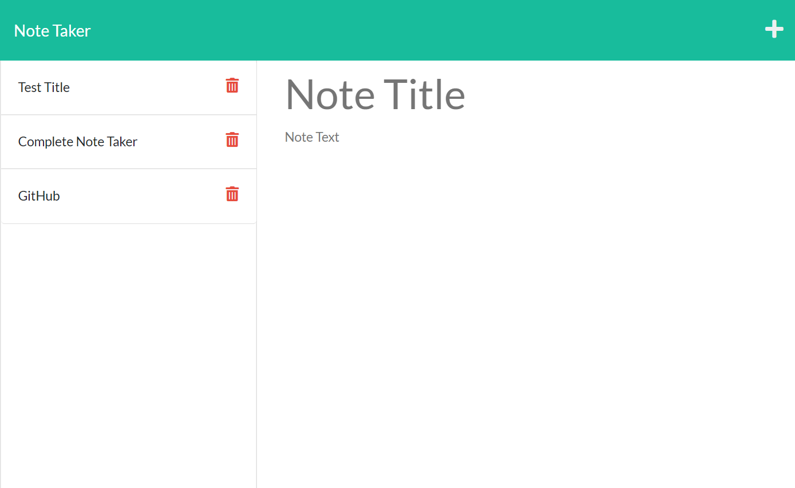

# Note-Taker

## Table of Contents

- [Description](#description)
- [Installation](#installation)
- [Usage](#usage)
- [Application Examples](#examples)
- [Contact Information](#contact)

## Description

Note Taker is a Node.js application that is designed to allow users to write and save notes so that they can organize their thoughts and keep track of daily tasks. This application uses Express. js to connect the client-side with the back-end server. Additionally, the application is deployed on Heroku. 

## Installation

- node.js needs to be installed prior to use
- open terminal
- clone the repo: `https://github.com/NAli3107/Note-Taker`
- cd into new directory
- download JSON packages by entering `npm i`
- install `Express.js` 
- enter `node server.js`
- API server will now listen on port 3001!

## Usage

A responsive and dynamic application is deployed on Heroku that allows users to take and save notes. 

When a user opens Note Taker, they are presented with a landing page that provides a link to the notes page.

When they click on the link to the notes page, then they are presented with a page with existing notes listed in the left-hand column, plus empty fields to enter a new note title and the note’s text in the right-hand column.

Once a user enters a new note title and the note’s text, a `Save` icon appears in the navigation at the top of the page. Upon clicking this `Save` button, the new note they have entered is saved and appears in the left-hand column with the other existing notes.

Next, the user can also click on an existing note in the list on the left-hand column of the page. This will cause the existing note to appear in the right-hand column of the page.

Finally, if they click on the `Write` icon in the navigation at the top of the page, then they are presented with empty fields to enter a new note title and the note’s text in the right-hand column.

## Examples

Screenshot of Application:

Deployed Application: https://tranquil-escarpment-50340.herokuapp.com/notes

Team Profile Generator GIF:

## Contact

Email Address: Nadiraali188a@gmail.com

Linkedin Profile: [LinkedIn](https://www.linkedin.com/in/nadira-ali-09a182106/)

Github: [Profile](https://github.com/NAli3107)

Github: [Repository](https://github.com/NAli3107/Note-Taker)